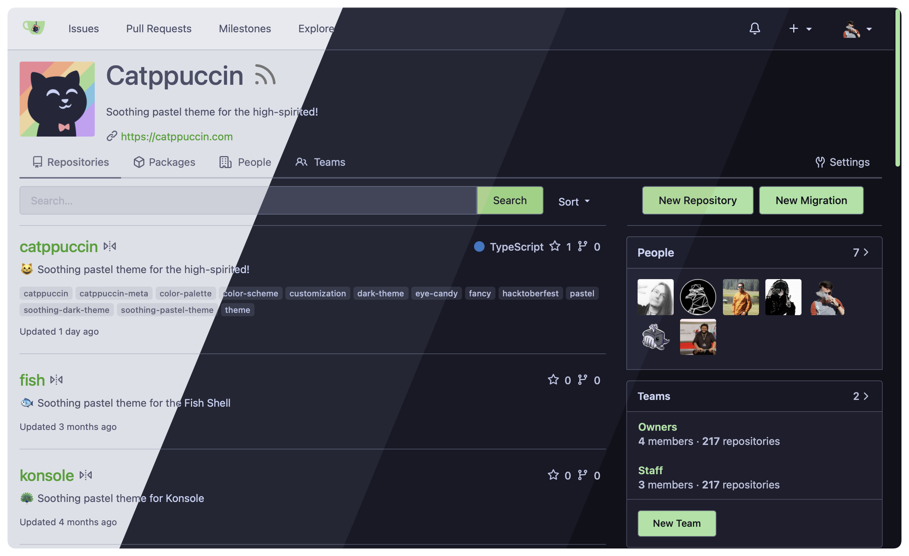
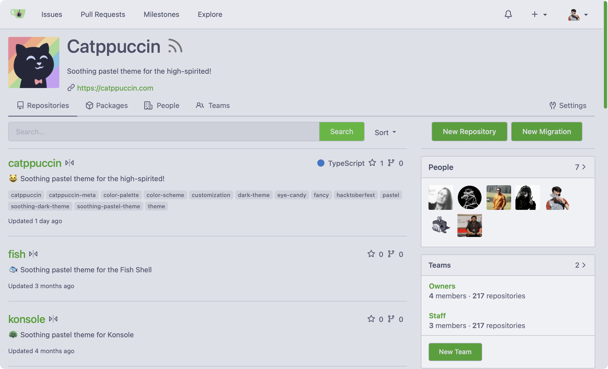
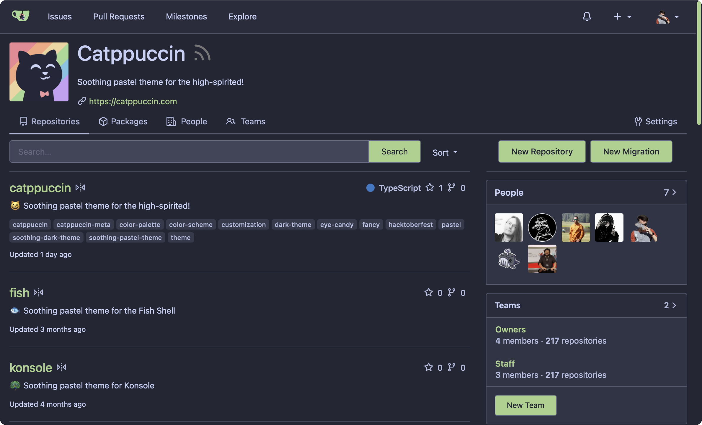
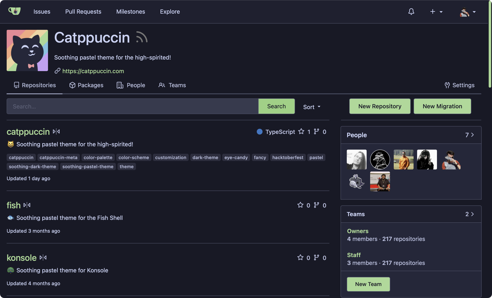
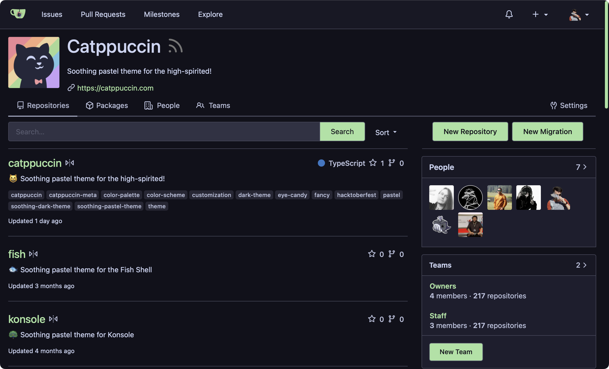

<h3 align="center">
 <br/>
 
 Catppuccin for <a href="https://gitea.io">Gitea</a>
 
</h3>

<p align="center">
 <a href="https://github.com/catppuccin/gitea/stargazers"></a>
 <a href="https://github.com/catppuccin/gitea/issues"></a>
 <a href="https://github.com/catppuccin/gitea/contributors"></a>
</p>

<p align="center">
 
</p>

## Previews

<details>
<summary>🌻 Latte</summary>

</details>
<details>
<summary>🪴 Frappé</summary>

</details>
<details>
<summary>🌺 Macchiato</summary>

</details>
<details>
<summary>🌿 Mocha</summary>

</details>

## Usage

> [!IMPORTANT]  
> Gitea 1.20 or newer is required for this theme.

1. Download the [latest GitHub release](https://github.com/catppuccin/gitea/releases/latest).
2. Place the CSS files inside Gitea's configuration directory:
   - Gitea 1.21.0 or newer: `$GITEA_CUSTOM/public/assets/css`
   - Otherwise: `$GITEA_CUSTOM/public/css`
3. Add the themes to your `app.ini`. See the [Gitea documentation](https://docs.gitea.io/en-us/customizing-gitea/#customizing-the-look-of-gitea).

   Here's a snippet if you want to offer all flavor-accent combinations:

<!-- AUTOGEN:INI START -->
<!-- the following section is auto-generated, do not edit -->

   ```ini
   [ui]
   THEMES = catppuccin-latte-rosewater,catppuccin-latte-flamingo,catppuccin-latte-pink,catppuccin-latte-mauve,catppuccin-latte-red,catppuccin-latte-maroon,catppuccin-latte-peach,catppuccin-latte-yellow,catppuccin-latte-green,catppuccin-latte-teal,catppuccin-latte-sky,catppuccin-latte-sapphire,catppuccin-latte-blue,catppuccin-latte-lavender,catppuccin-frappe-rosewater,catppuccin-frappe-flamingo,catppuccin-frappe-pink,catppuccin-frappe-mauve,catppuccin-frappe-red,catppuccin-frappe-maroon,catppuccin-frappe-peach,catppuccin-frappe-yellow,catppuccin-frappe-green,catppuccin-frappe-teal,catppuccin-frappe-sky,catppuccin-frappe-sapphire,catppuccin-frappe-blue,catppuccin-frappe-lavender,catppuccin-macchiato-rosewater,catppuccin-macchiato-flamingo,catppuccin-macchiato-pink,catppuccin-macchiato-mauve,catppuccin-macchiato-red,catppuccin-macchiato-maroon,catppuccin-macchiato-peach,catppuccin-macchiato-yellow,catppuccin-macchiato-green,catppuccin-macchiato-teal,catppuccin-macchiato-sky,catppuccin-macchiato-sapphire,catppuccin-macchiato-blue,catppuccin-macchiato-lavender,catppuccin-mocha-rosewater,catppuccin-mocha-flamingo,catppuccin-mocha-pink,catppuccin-mocha-mauve,catppuccin-mocha-red,catppuccin-mocha-maroon,catppuccin-mocha-peach,catppuccin-mocha-yellow,catppuccin-mocha-green,catppuccin-mocha-teal,catppuccin-mocha-sky,catppuccin-mocha-sapphire,catppuccin-mocha-blue,catppuccin-mocha-lavender
   ```

<!-- AUTOGEN:INI END -->

   Additionally or alternatively, you add the `auto` versions which ensure
   that the theme automatically switches between light (latte) and dark (mocha)
   mode:

<!-- AUTOGEN:INI-AUTO START -->
<!-- the following section is auto-generated, do not edit -->

   ```ini
   [ui]
   THEMES = catppuccin-rosewater-auto,catppuccin-flamingo-auto,catppuccin-pink-auto,catppuccin-mauve-auto,catppuccin-red-auto,catppuccin-maroon-auto,catppuccin-peach-auto,catppuccin-yellow-auto,catppuccin-green-auto,catppuccin-teal-auto,catppuccin-sky-auto,catppuccin-sapphire-auto,catppuccin-blue-auto,catppuccin-lavender-auto
   ```

<!-- AUTOGEN:INI-AUTO END -->

4. Restart your Gitea instance.
5. Select the theme in Gitea > Account > Settings > Appearance.

## 💝 Thanks to

- [winston](https://github.com/nekowinston)

&nbsp;

<p align="center">
 
</p>

<p align="center">
 Copyright &copy; 2021-present <a href="https://github.com/catppuccin" target="_blank">Catppuccin Org</a>
</p>

<p align="center">
 <a href="https://github.com/catppuccin/catppuccin/blob/main/LICENSE"></a>
</p>
